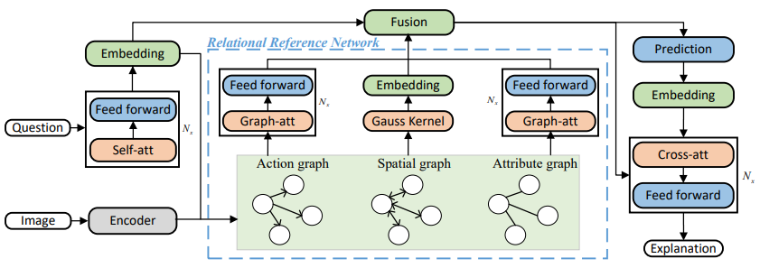
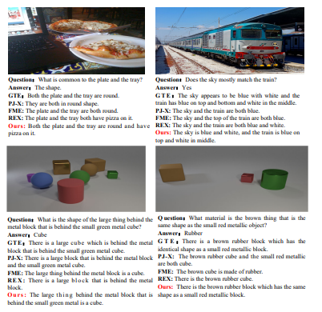

# Multi-Entity Relational Reasoning based Explanation

This code repository is for our ICIP 2023 paper (under review), entitled **MERGE: MULTI-ENTITY RELATIONAL REASONING BASED EXPLANATION IN VISUAL
QUESTION ANSWERING**.
 
## Overview
In order to solve VQA tasks in complex scenarios involving multiple entities and obtain reliable explanations, we use visual relational reasoning to enhance the overall understanding of
image scenes and improve the accuracy of predicted answers and explanations. Specifically, we propose a multi-entity relational reasoning based explanation method (MERGE) to
construct action relations, spatial relations, and attribute relations of question-related entities in images. Then we encode
contextual visual features through the graph attention mechanism, and fuse question and answer embeddings to generate
more accurate textual explanations. We conducted extensive experiments on seven datasets including [VQA2.0](https://arxiv.org/abs/1612.00837), [VQA-CP2](https://arxiv.org/abs/1712.00377), [GQA](https://arxiv.org/abs/1902.09506), [VQA-CE](https://arxiv.org/abs/2104.03149), [VQA-X](https://arxiv.org/abs/1802.08129), [VCR](https://arxiv.org/abs/1811.10830) and [CLEVR-X](https://arxiv.org/abs/2204.02380), to verify superior answer accuracy and high quality explanations.

## Dependencies:
We develop the codes on Windows operation system, and run the codes on Ubuntu 18.04. The codes depend on Python 3.7. Other packages (e.g., PyTorch) can be found in the `./requirements.txt`.

## Configuration & Usage
#### 1. Datasets
* Seven datasets are leveraged. Note that for the security consideration, these seven datasets are required to follow the policies of their own. 

&emsp; For VQA2.0, we can download the image features annotations, and other relevant information from [url](http://www.visualqa.org/). 

&emsp; For VQA-CP2, we can download it from [url](http://www.visualqa.org/). The website provides links to download the annotations and the images used in the dataset.

&emsp; For GQA, we can download it from [url](https://cs.stanford.edu/people/dorarad/gqa/download.html). 

&emsp; For VQA-CE, we can download it from [url](https://github.com/MILVLG/vqa-challenging-exams). You can find the instructions for downloading the dataset in the repository's README file. Note that the VQA-CE dataset is a challenging extension of the popular VQA dataset

&emsp; For VQA-X, we can download it from [url](https://github.com/facebookresearch/vqa-x). Note that the VQA-X dataset is an extension of the popular VQA dataset.

&emsp; For VCR, we can download it from [url](https://visualcommonsense.com/download). 

&emsp; For CLEVR-X, we can download it from [url](https://cs.stanford.edu/people/jcjohns/clevr-x/). CLEVR-X is a large-scale, diverse and challenging dataset for visual reasoning and common sense. It is an extension of the popular CLEVR dataset and was introduced in the paper "CLEVR-X: A More Diverse and Realistic Extension of CLEVR" by Johnson et al.


#### 2. Configure
For the purpose of convenience, we provide a `config.json` file. Before running, all things are changed in the following:
* Modify the `project_root=/absolute/path/to/MERGE/`. 

* Modify the `database_dir=/absolute/path/to/datasets`. For more details (Optionally), there are `` or `` datasets in this directory with the structure:
```
datasets
|---VQA2.0
      |---questions    % questions folder(train, valid, test)
      |---iamges       % iamges folder(train, valid, test)
      |---annotations  % annotations folder(train, valid, test)
|---GQA
      |---questions    % questions folder(train, test)
      |---iamges       % iamges folder(train, test)
      |---annotations  % annotations folder(train, test)
|---VQA-CP2
      |---questions    % questions folder(train, valid, test)
      |---iamges       % iamges folder(train, valid, test)
      |---annotations  % annotations folder(train, valid, test)
|---VQA-CE
      |---questions    % questions folder(train, test)
      |---iamges       % iamges folder(train, test)
      |---annotations  % annotations folder(train, test)
|---VCR
      |---questions    % questions folder(train, test)
      |---iamges       % iamges folder(train, test)
      |---annotations  % annotations folder(train, test)
|---VQA-X
      |---questions    % questions folder(train, valid, test)
      |---iamges       % iamges folder(train, valid, test)
      |---annotations  % annotations folder(train, valid, test)
      |---explanations % explanations folder(train, valid, test)
|---CLEVR-X
      |---questions    % questions folder(train, test)
      |---iamges       % iamges folder(train, test)
      |---annotations  % annotations folder(train, test)
      |---explanations % explanations folder(train, test
```

#### 3. Usage
We suggest users to create a conda environment to run the codes. In this spirit, the following instructions may be helpful:
1. Create a new environment: `conda create -n merge python=3.7`
2. Activate the environment and install dependencies: `conda activate merge` and `pip install -r requirements.txt`
3. Next step:
```bash
python3 main.py --config config.json
```

```bash
python3 eval.py --output_folder pretrained_models/merge
```
#### 4. Examples



## License && Issues

We will make our codes public available under a formal license. For now, this is still an ongoing work and we plan to report more results in the future work.


 

